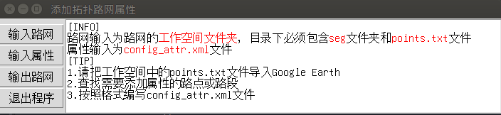

### 目录结构
拓扑路网生成GUI工具：`genRoad.py`。路网属性添加GUI工具`addAttr.py`.路网相关的各种脚本工具在`tools`文件夹下。

```
.
├── addAttr.py
├── doc(dir)
├── example(dir)
│   ├── changsha_May22(dir)
│   ├── config_attr.xml
│   ├── Example.kml
│   ├── KYXZ2018A.txt
│   └── txt2kml(dir)
├── figure(dir)
├── genRoad.py
├── lib(dir)
└── tools(dir)
    ├── dirsRoadGen.py
    ├── genSparseRoadpoint.py
    ├── modifyTasks.py
    ├── selectTaskPoints.py
    ├── showLink.py
    └── txt2kml.py
```

### 拓扑路网生成GUI工具
编辑、生成、检查拓扑路网。[中文教程](./doc/generate_topology_road_zh.md)，[English Tutorial](./doc/generate_topology_road_zh.md)。


### 路网属性添加GUI工具
添加路点属性。可根据需要为为路点添加任意需要的属性和值。[中文教程](./doc/add_attribute.md)。



### 路网相关脚本
lib文件夹下为处理路网相关的脚本。
- [从多个文件夹中读取暂存路段创建拓扑路网](./doc/dirs_generate_road.md)
- [生成稀少路点的拓扑路网，用于终端显示](./doc/generate_sparse_road.md)
- [在Google Earth中修改任务点](./doc/modify_tasks.md)
- [检查拓扑路网](./doc/show_link.md)
- [把txt文件转换为kml文件](./doc/rosbag2txt2kml.md)

## 更新日记
2019.06.12 完成了路网属性添加GUI程序
2019.06.11 调整了界面中的文字大小，使其更易于阅读
2019.06.08 优化了输入工作空间名称之后提示框的内容和顺序
2019.06.05 解决了中文路径问题，程序可以自动识别系统创建和访问目录

### Contributor
Nobody Wu: [GitHub](https://github.com/nobodywu), [CSDN](https://blog.csdn.net/NobodyWu)


<br>
<p align="right"> Auther: Wu Mengze<br>Date: Jun 12 2019</p>
