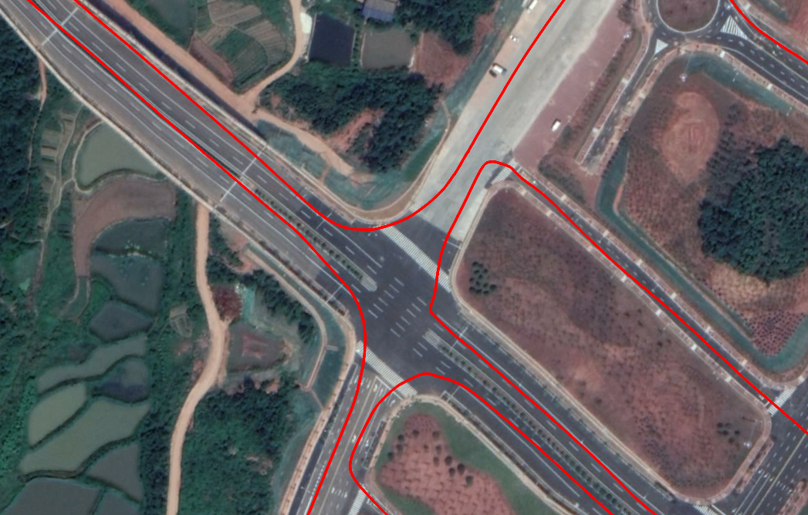
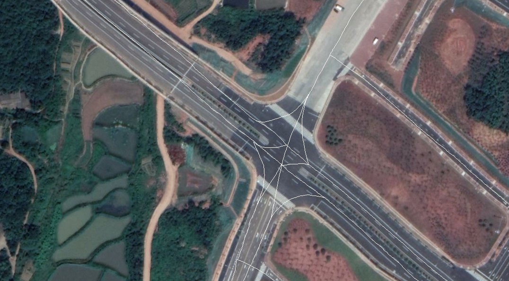
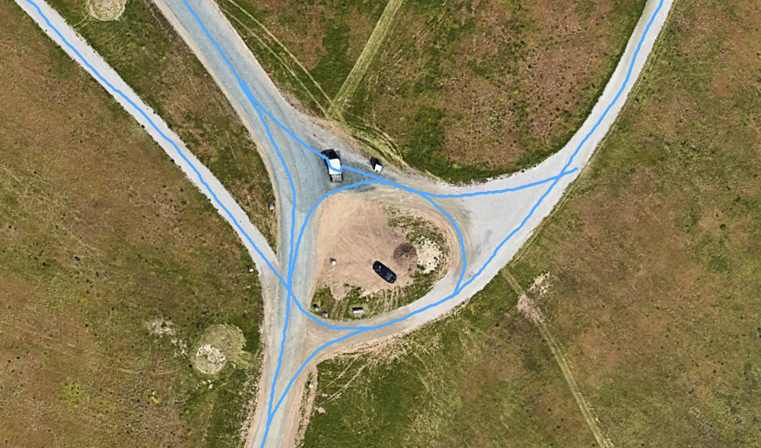
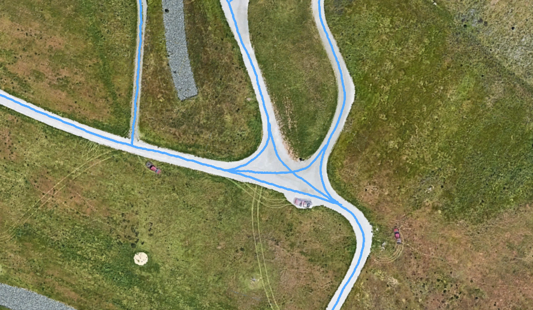
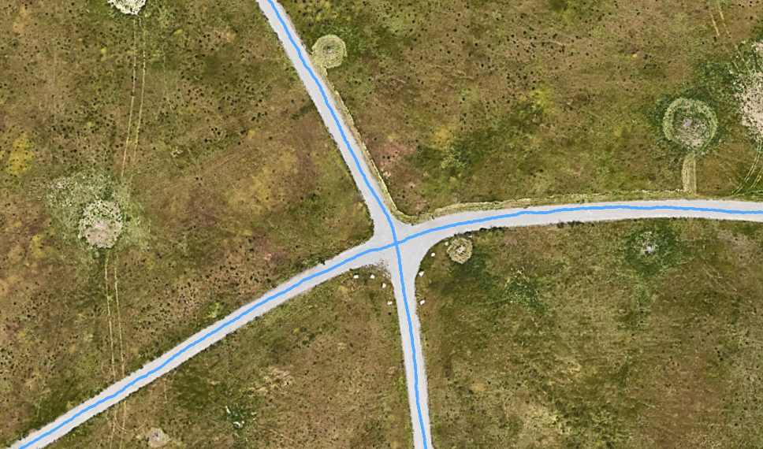

路网中道路位置信息的来源有两种：
- 实车采集数据。更为准确，需要在Google Earth中进行修正才能开始路段选择和路网创建工作
- Google Earth中的数据。不太准确，获取方便

创建拓扑路网依据的捕获距离为8.1m，因此**需要保证路段长度大于8.1m**，可用Google Earth中的 测量工具进行测量。

实车采集数据的路口和修正后路口示例:  

实车采集数据导入Google Earth中可以明显看到卫星图存在误差。车辆行驶的过程中会有靠边停车现象，需要对其进行修正。此外，每个路口出都需要进行处理。

标准路口示例：

左边两个为大路口，右边一个为小路口。绘制路口时因考虑车辆的行驶线路。

Q: 如何修改捕获距离?   
A: 捕获距离是判断路段连接关系是使用的距离，路段长度需要**大于**捕获距离。选择路网时的端点范围提示圈半径应该**略小于**捕获距离，建议小于0.1。暂未提供接口，需要手动修改
- 修改提示半径。`lib/selectSeg.py`中App类，initCanvas函数self.radius变量，单位m
- 修改捕获距离。`lib/setJunctions.py`中Config类的self.dis_delta变量，单位m
- 例如：self.radius = 8, self.dis_delta =8.1。

 

 Auther: Wu Mengze Date: Jun 12 2019

