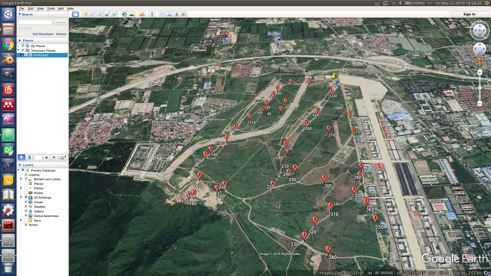

由于赛方提供的任务点存在不合理（相对于全局规划逻辑）或者存在偏差，需要在接收任务文件全局路径规划之前对任务文件进行重新编辑。该脚本加载txt格式的任务文件并在Google Earth上显示出来。Google Earth的点序号为任务文件中点序号×10，任务文件的类型用图片区分。可在Google Earth上对任务点进行移动、删除和添加操作。

### 使用步骤
- 安装[Google Earth Pro](https://www.google.com/earth/download/gep/agree.html)
- 在配置好的环境中运行`(py36)$ python modifyTasks.py`
- 通过对话框选择任务文件
- 进行调整，请看编辑任务点小节

### 任务文件
2018跨越险阻任务文件为`example/KYXZ2018A.txt`。格式为:
| num | lon | lat | alt | type |
| :--: | :--: | :--: | :--: | :--: |
| 1  | 116.11529225  | 40.16971802  | 0.00000000  | 0  |

type类型说明:
| 0 | 1 | 2 | 3 | 4 | 5 |
| :--: | :--: | :--: | :--: | :--: | :--: |
| start_point | end_point | way_point | search | scout_start | scout_start |

### 输入和输出
变量`fileName`为输入的原始任务文件路径`~/taskfile/`，程序中自动识别`~/`目录，但需要python3.5+，如果是其他python3版本，根据本地目录做出更改。程序运行过程中会与任务文件相同的目录下生成名为`KYXZ.kml`、 `KYXZ.txt`、`1.kml`和`KYXZ2018A.txt`四个文件。

`KYXZ.kml` 为输入的原始任务文件转换而来。 
`KYXZ.txt` 仅为检查用，使用文本编辑器打开。 
`1.kml` 生成的临时文件，用于转化为 KYXZ2018A.txt   
`KYXZ2018A.txt` 最后生成的任务文件覆盖掉了原来的任务文件，需要特别注意。

### 编辑任务点

1. **名称** 代表任务点顺序，**图片** 代表任务点类型。  
为方便增加任务点操作，任务点的**名称** 为序号×10。  
[⻩色](http://maps.google.com/mapfiles/kml/pushpin/ylw-pushpin.png)代表起点，
[蓝色](http://maps.google.com/mapfiles/kml/pushpin/blue-pushpin.png)代表终点，
[红色2](http://maps.google.com/mapfiles/kml/paddle/2.png)代表任务点类型type2，
[红色3](http://maps.google.com/mapfiles/kml/paddle/3.png)代表任务点类型type3，
[红色4](http://maps.google.com/mapfiles/kml/paddle/4.png)代表任务点类型type4，
[红色5](http://maps.google.com/mapfiles/kml/paddle/5.png)代表任务点类型type5，
[白色圆圈](http://maps.google.com/mapfiles/kml/shapes/placemark_circle.png)代表其他类型的任务点，不会出现此情况。点击可查看各个类型的图片。

2. 在打开的google earth pro上编辑任务点。
    - 移动任务点。选择需要移动的任务点，右键点击properties，快捷键为alt+enter。左键拖动到合适的位置。
    - 删除任务点。
    - 增加任务点。复制一个类型**相同的任务点** ，右键properties，修改**名称** ，并移动到合适的位置。**名称不需要连续，但需要按顺序** 。

3. 右键`Temporary Places`文件夹save as为kml格式的文件`1.kml`，目录为任务文件的目录，即`fileName`变量所在目录。注意此文件**名称**、**后缀** 和**目录**。

4. 生成新的任务文件，新的任务文件会**替换** 掉程序输入的任务文件。  关闭google earth pro，如果成功关闭，自动执行kml暂存文件`1.kml`  转txt任务文件`KYXZ2018A.txt` 程序，并**打印** 调整后的任务点信息。如果关闭google earth pro窗口后，该程序仍在后台运行，则需要手动杀死该进程。
在terminal中输入 `kill $(ps -A | grep earth |awk '{print $1}')` ，不需要终止python程序的运行。

**提醒**：每次程序运行都会强制杀掉 google earth pro  ，并且删除目录下存在旧的 1.kml  文件。

 
 

 Auther: Wu Mengze Date: Jun 12 2018

